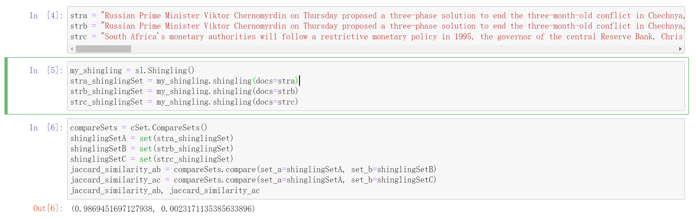
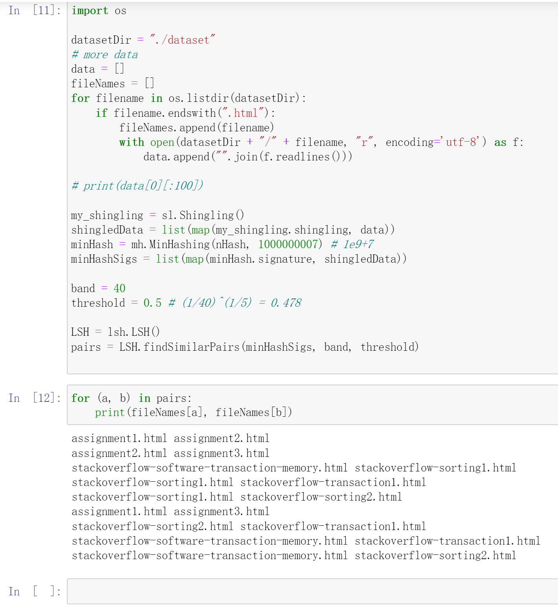

# Group 25 Solution for Homework 1

### How to build and run

Run `hw1.ipynb` with Jupyter Notebook at root directory.

### Solution

Input text (as raw string) is first shingled with k=9, then we tried to print the jaccard similarity between these shingled sets. For larger dataset, we generated 200 hash functions and used minhash to calculate its minhash signature, and finally, we used LSH with band size of 40 to find similar text pairs.

### Screenshots

Jaccard similarity between texts (stra, strb, and strc)

Similar texts using LSH, from the result, we can see webpages from KTH are grouped together while pages from Stack Overflow are grouped together.

